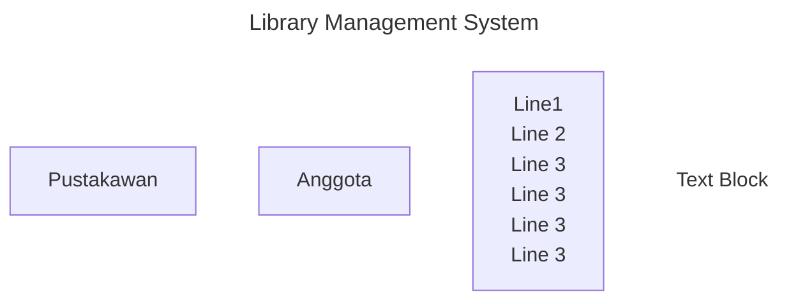

# Library Management System

## 🔓 Endpoint Tanpa Authentication

```http
  POST	/auth/login
```
```http
  GET	/buku/find-all
```
```http
  GET	/buku/find-by-id/{id}
```
```http
  GET	/lokasi/find-all
```
```http
  GET	/lokasi/find-by-id/{id}
```
## 🔐 Endpoint Dengan Authentication dan Authorization (Role: Pustakawan)
```http
  DELETE    /user/delete/{id}
```
```http
  GET	    /user/find-all
```
```http
  DELETE	/peminjaman/delete/{id}
```
```http
  GET	    /peminjaman/find-all
```
```http
  POST	    /lokasi/add
```
```http
  DELETE	/lokasi/delete/{id}
```
```http
  PUT	    /lokasi/edit
```
```http
  POST	    /buku/add
```
```http
  DELETE	/buku/delete/{id}
```
```http
  PUT	    /buku/edit
```
<pre>

<pre>
